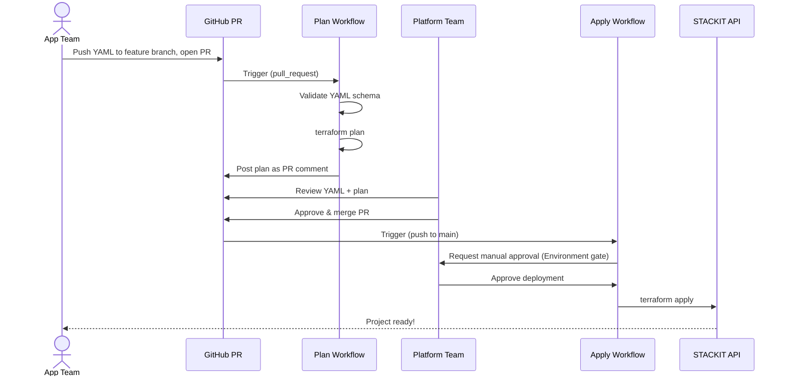

# Self-Service Project Onboarding – CI/CD Workflows

This directory contains the GitHub Actions workflows that power the self-service project onboarding for the STACKIT Landing Zone.

## Overview

Application teams can request their own STACKIT project by submitting a YAML file via Pull Request. The platform team reviews the request, and upon merge, the project is automatically provisioned with all guardrails (network, security groups, IAM, DNS).

```
Team submits PR          Platform reviews          Merge triggers apply
     │                         │                         │
     ▼                         ▼                         ▼
┌──────────┐            ┌──────────┐            ┌───────────────┐
│  YAML    │───────────▶│  Review  │───────────▶│   Terraform   │
│  Request │  validate  │  + Plan  │  approve   │     Apply     │
└──────────┘  + plan    └──────────┘  + merge   └───────────────┘
```

## Workflows

### `project-onboarding-plan.yaml`

**Trigger:** Pull Request against `main` with changes in `03-projects/` or `modules/project-factory/`

**What it does:**

1. **Validate** – Checks all new/modified YAML request files for:
   - Required fields (`project_name`, `team`, `environment`, `owner_email`)
   - Valid environment values (`dev`, `staging`, `prod`)
   - Valid member roles (`owner`, `editor`, `reader`)
2. **Plan** – Runs `terraform plan` against the project factory layer
3. **Comment** – Posts the plan output as a PR comment (updates on subsequent pushes)

**Permissions:** Read access to contents, write access to pull requests (for commenting).

### `project-onboarding-apply.yaml`

**Trigger:** Push to `main` with changes in `03-projects/requests/`

**What it does:**

1. Waits for **manual approval** via GitHub Environment protection rules
2. Runs `terraform plan` + `terraform apply`

**Approval Gate:** The job uses the `stackit-production` GitHub Environment. Configure "Required reviewers" in your repository settings under Settings → Environments → `stackit-production`.

## Setup

### Prerequisites

1. All landing zone layers (00-bootstrap through 02-spokes) must be applied at least once before the pipeline can run. The project factory reads remote state from the hub and spoke layers.

2. Configure the following GitHub Environments:

| Environment | Purpose | Protection Rules |
|---|---|---|
| `dev` | Plan workflow – access to state backend credentials | None required |
| `stackit-production` | Apply workflow – provisions real infrastructure | **Required reviewers** (platform team) |

### Required Secrets

Add these secrets to **both** environments (`dev` and `stackit-production`):

| Secret | Description |
|---|---|
| `AWS_ACCESS_KEY_ID` | S3-compatible Object Storage access key (from bootstrap output) |
| `AWS_SECRET_ACCESS_KEY` | S3-compatible Object Storage secret key (from bootstrap output) |
| `STACKIT_SA_KEY_JSON` | Content of the service account key JSON file |
| `STACKIT_SA_PRIVATE_KEY` | Content of the RSA private key PEM file |

### How to Get the Secrets

```bash
# After bootstrap is applied:
cd 00-bootstrap
terraform output -raw state_access_key    # → AWS_ACCESS_KEY_ID
terraform output -raw state_secret_key    # → AWS_SECRET_ACCESS_KEY

# From your .secrets/ directory:
cat .secrets/sa-key.json                  # → STACKIT_SA_KEY_JSON
cat .secrets/sa-key.pem                   # → STACKIT_SA_PRIVATE_KEY
```

## Requesting a Project

1. Copy the template:
   ```bash
   cp 03-projects/requests/_template.yaml 03-projects/requests/<team>-<env>.yaml
   ```

2. Fill in the required fields:
   ```yaml
   project_name: "team-phoenix-dev"
   team: "phoenix"
   environment: "dev"
   owner_email: "phoenix-lead@example.com"

   members:
     - email: "phoenix-lead@example.com"
       role: "owner"
     - email: "phoenix-dev1@example.com"
       role: "editor"

   extra_labels:
     cost_center: "cc-4200"
     application: "phoenix-api"
   ```

3. Open a Pull Request against `main`.

4. The plan workflow runs automatically. The platform team reviews both the YAML and the Terraform plan.

5. Upon merge, the apply workflow triggers. A platform team member approves the deployment in the GitHub Actions UI.

6. Terraform provisions the project with:
   - STACKIT project attached to the environment's network area
   - Routed network with L3 connectivity within the environment
   - Security groups (HTTPS + SSH from spoke, all egress)
   - Custom RBAC role (`team-editor` – editor without public IP and IAM permissions)
   - IAM role assignments for all team members
   - Delegated DNS zone (`<project>.dev.<domain>`)

## Diagram


