# STACKIT Landing Zone — Architecture

## High-Level Overview

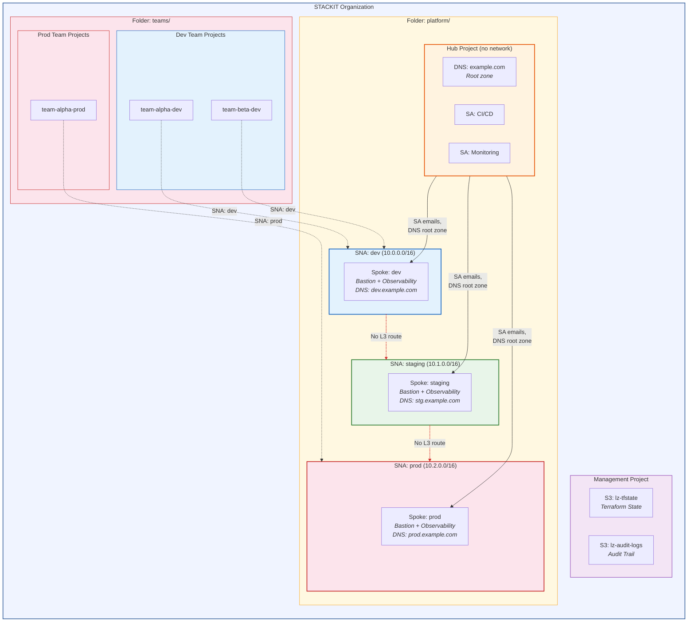

## What Each Project Gets (Project Factory)

Every team project is provisioned with identical guardrails via a YAML request:

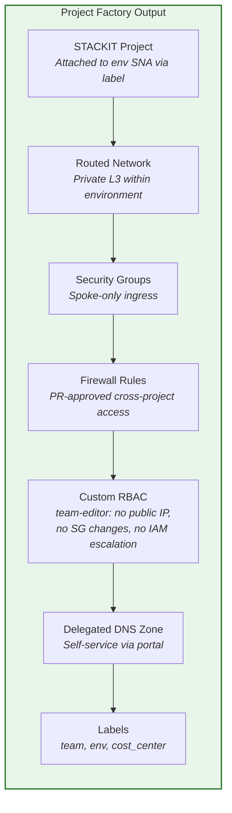

## Network Isolation

Each environment has its own STACKIT Network Area (SNA), providing **L3-level isolation** between dev, staging, and prod. There is no routing path between environments — isolation is enforced at the network layer, not just by security groups.

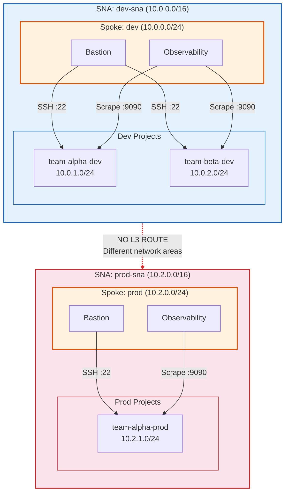

**How isolation works:**
- Each environment is a separate L3 routing domain — **no routing path between dev/staging/prod**
- SG ingress rules only allow the spoke network's prefix (same-environment traffic)
- Teams cannot modify security groups (permission denied via custom RBAC)
- Cross-project access within the same environment requires a `firewall_rules` entry in YAML, approved via PR
- No public IPs allowed (permission denied via custom RBAC)

## DNS Delegation

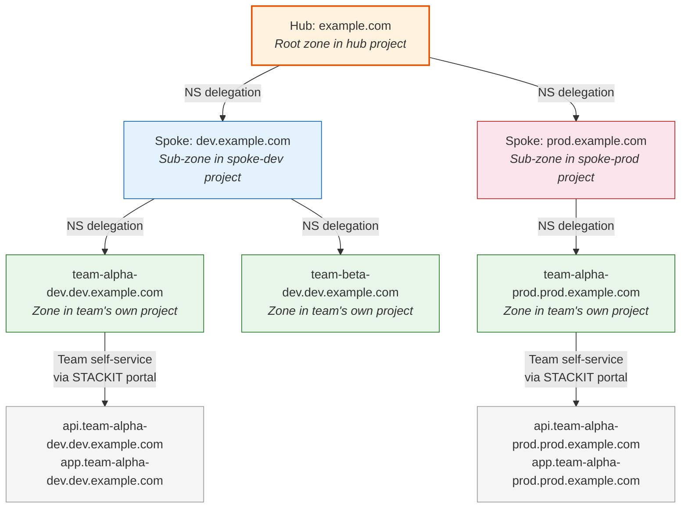

## IAM Model

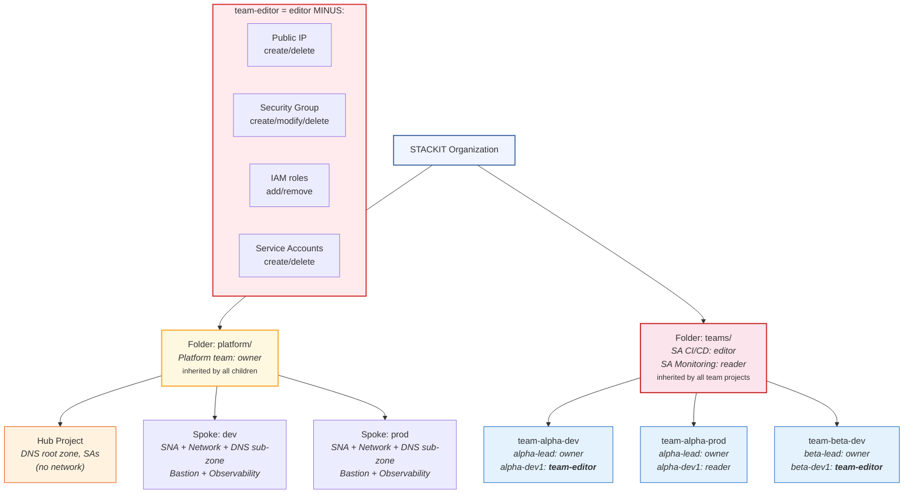

## Self-Service Project Request Flow

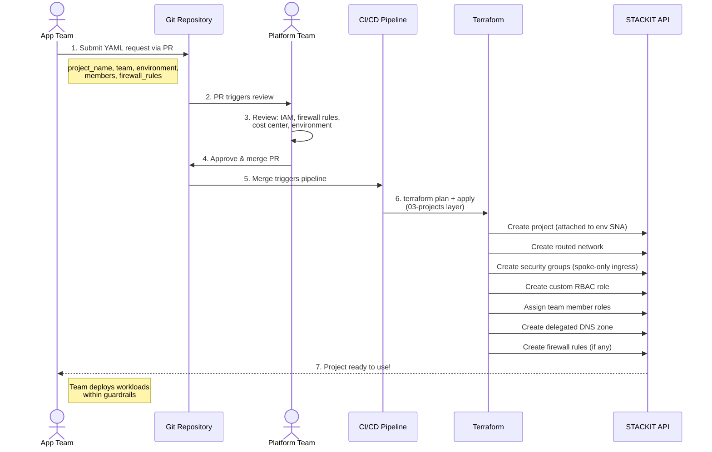

## Deployment Layers

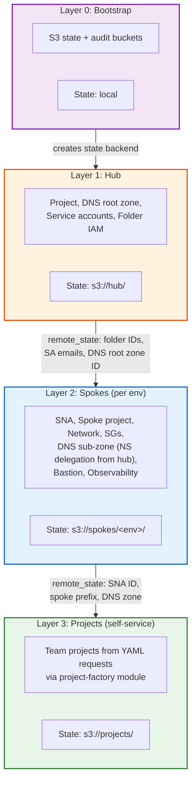

## Example: Development Workload (SKE Kubernetes)

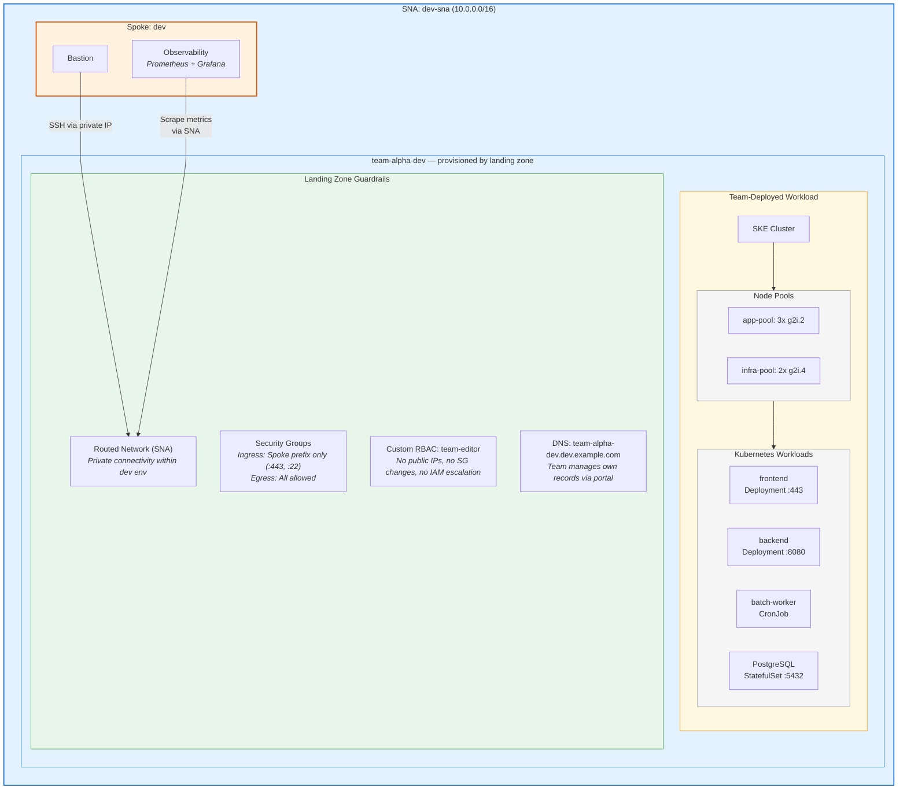

## Example: Production Workload (IaaS VMs)

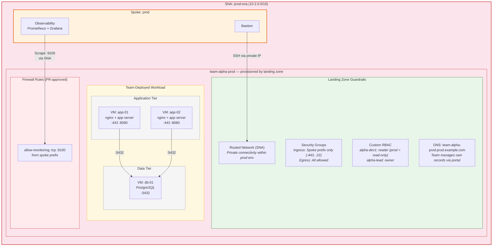

## IP Allocation & Network Capacity

### Per-Environment SNA IP Ranges

Each environment gets its own SNA with a dedicated `/16` IP pool:

| Environment | SNA Name | Network Range | Transfer Network |
|-------------|----------|---------------|------------------|
| dev | `dev-sna` | `10.0.0.0/16` | `10.255.0.0/24` |
| staging | `staging-sna` | `10.1.0.0/16` | `10.255.1.0/24` |
| prod | `prod-sna` | `10.2.0.0/16` | `10.255.2.0/24` |

### How SNA Assigns Subnets

When a project with the `networkArea` label creates a `routed = true` network, the SNA automatically allocates the **next available /24** from the pool — you cannot choose a specific subnet.

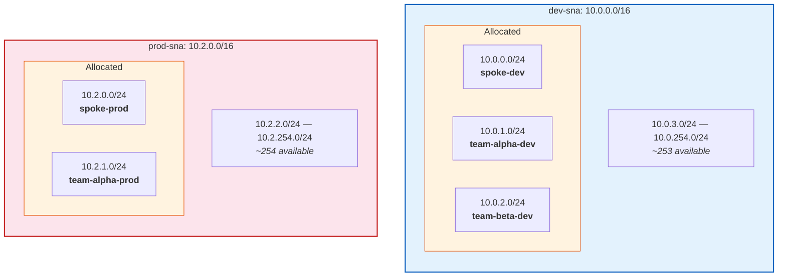

### Capacity Limits (per environment)

| Resource | Limit | Notes |
|----------|-------|-------|
| Total /24 subnets per env | **255** | 10.x.0.0/24 through 10.x.254.0/24 |
| Reserved for spoke | **1** | Spoke project network |
| Available for team projects | **~254** | Each routed network consumes 1 subnet |
| Usable IPs per subnet | **~251** | 5 reserved by STACKIT (gateway, broadcast, etc.) |
| VMs/interfaces per subnet | **~251** | 1 private IP per network interface |
| **Total across 3 envs** | **~762 team projects** | 254 per env x 3 environments |

### Scaling Options

| Strategy | Change | Result |
|----------|--------|--------|
| **Add ranges** | Add `{prefix="10.0.0.0/16"}, {prefix="10.3.0.0/16"}` to dev SNA | +255 subnets for dev |
| **Use /25 subnets** | `sna_default_prefix_length = 25` | 510 subnets per env, 126 IPs each |
| **Use /23 subnets** | `sna_default_prefix_length = 23` | 127 subnets per env, 510 IPs each |

### Important Constraints

- **One SNA per project** — a project can only attach to one network area (single `networkArea` label)
- **Fixed subnet size** — all networks in an SNA get the same prefix length; you cannot mix /23 and /24
- **No subnet selection** — STACKIT assigns the next available block automatically
- **Transfer network reserved** — must not overlap with network ranges
- **No cross-environment routing** — separate SNAs have no routing path between them (this is the desired isolation)

## Key Benefits

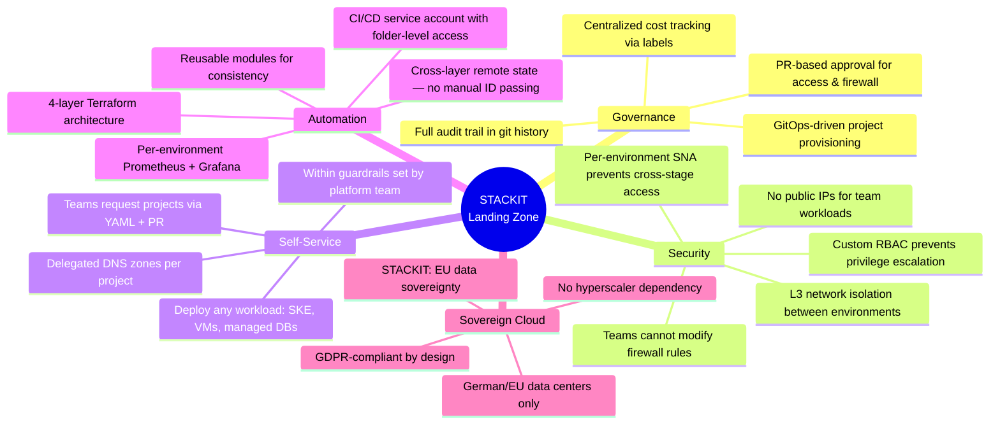

## YAML Request Example

```yaml
# 03-projects/requests/team-alpha-dev.yaml
project_name: "team-alpha-dev"
team: "alpha"
environment: "dev"
owner_email: "alpha-lead@company.com"

members:
  - email: "alpha-dev1@company.com"
    role: "editor"        # mapped to restricted "team-editor"
  - email: "alpha-dev2@company.com"
    role: "editor"

extra_labels:
  cost_center: "cc-1234"
  application: "webshop"

# Cross-project access within same environment (requires platform team PR approval)
# firewall_rules:
#   - name: "allow-beta-api"
#     protocol: "tcp"
#     ip_range: "10.0.2.0/24"
#     port_min: 8080
#     port_max: 8080
```
